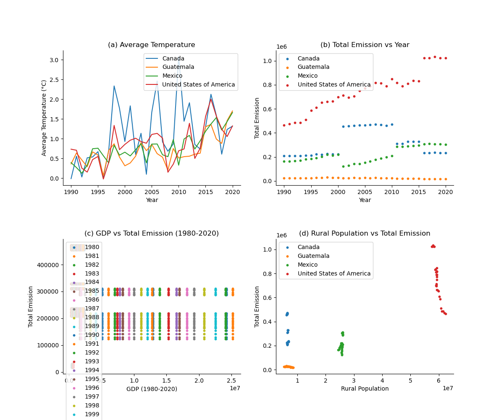

Dearest grandfather, I dont know how to say this but, you ruin thanksgiving every year. It feels as if you are always out to get me by starting divisive conversations. I know you are a staunch trump supporter that will not yield to my snowflake emotions so I instead have put together data to show you how wrong you are.

Starting from the top:
here is my graph 

 "Proof")

Figure 1A temperature by year in North america, the only continent you tihnk exists. As you see for past thirty years the temperature has a slow but steady incline! Clearly the earth is warming up.

No surprise at panel b we see that emission have also increased by year as has temperature. this is correlative: gas more hot, almost exactly how you feel when you eat too many beans in your car

In figure c grandpa, the years where we had more emissions GDP has stayed consistent probably. Therefore there is no correlation between the economy and emissions. So your usual arguement is moot.

Lastly, countries with more rural populations are also emitting more co2. Everytime you emit you are putting yourself at risk since you live on a farm, and all your other farm friends. Would you be so cold hearted to make them eat gas?

If you believe my analysis is biased feel free to look at my snake make file to reproduce it!  If i had more money I would try to show you how much places with great emission have higher cases of asthma and other respiratory diseases. That way I could confimr your beliefs are harming the farm friends!
